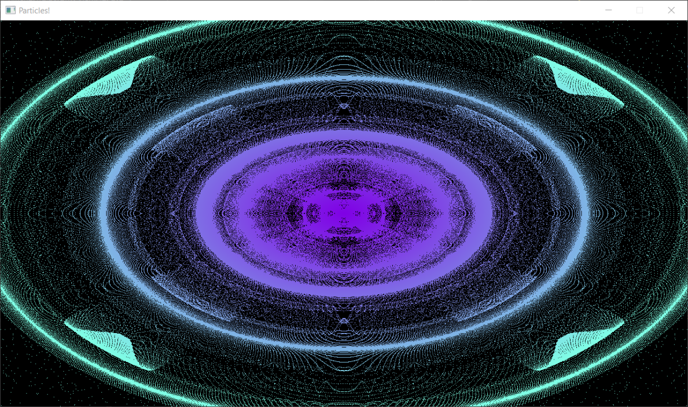
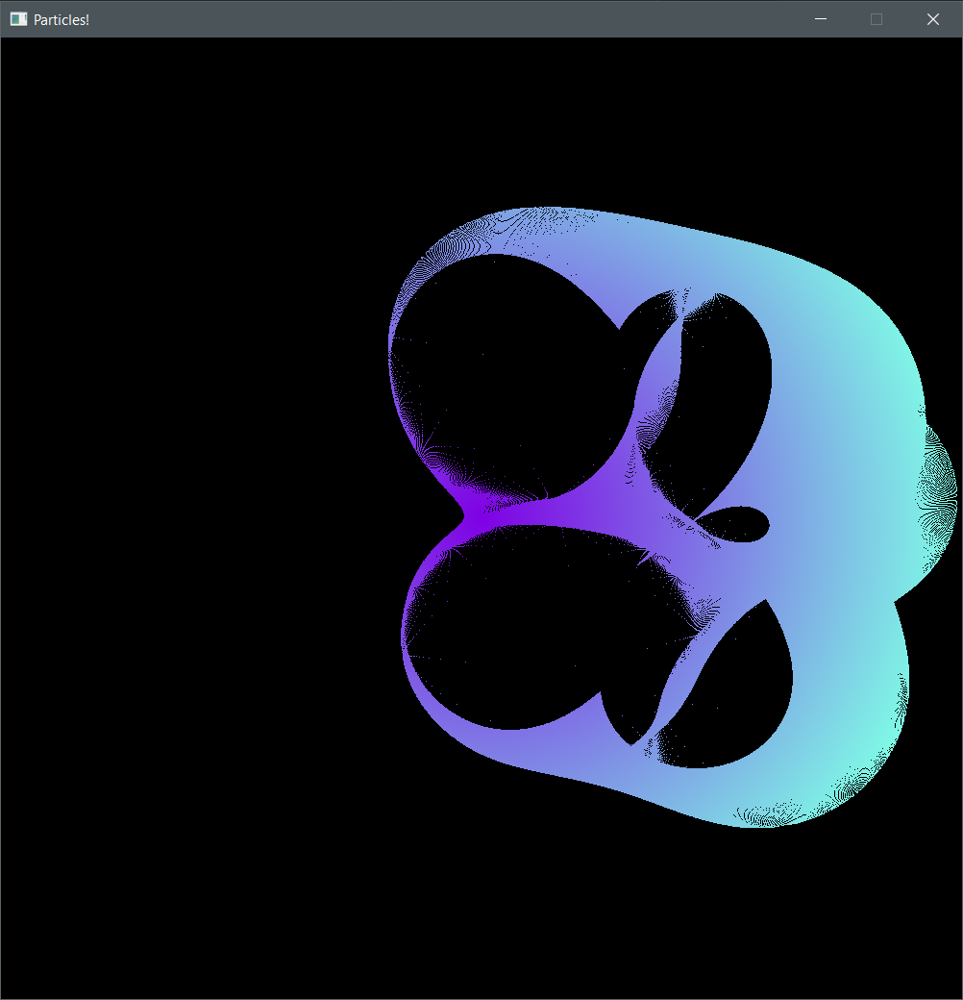
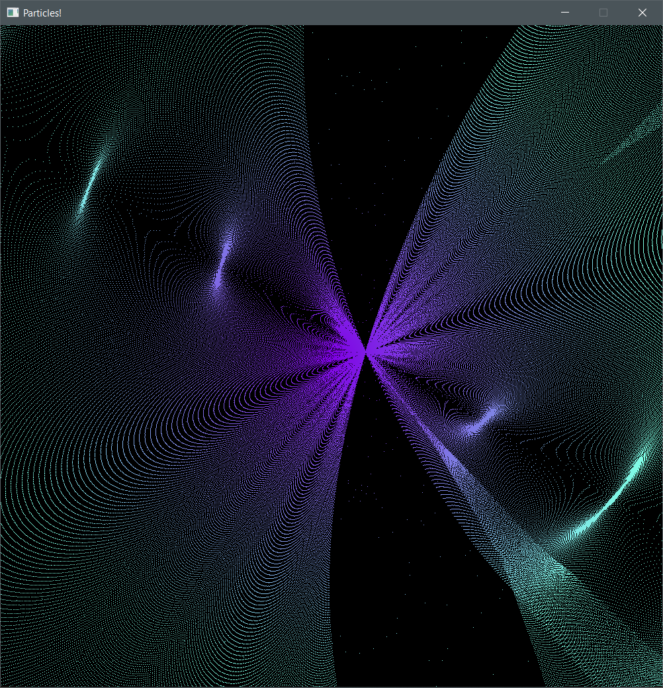
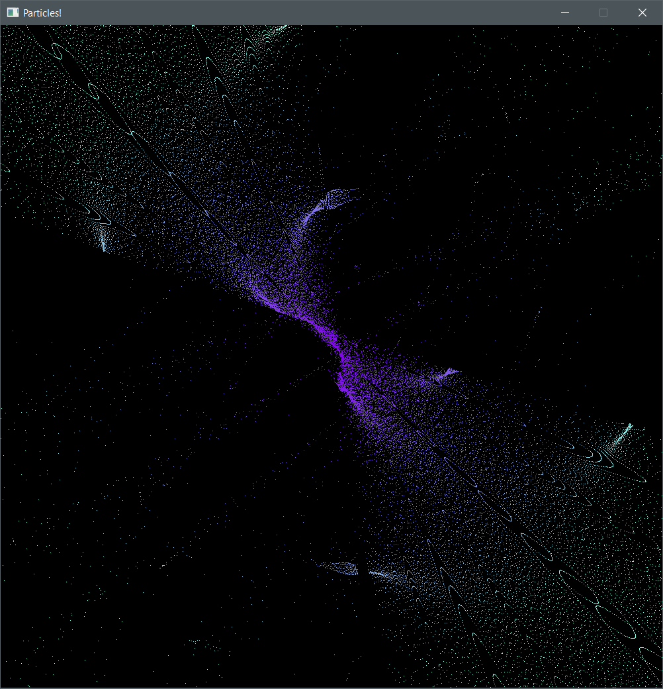
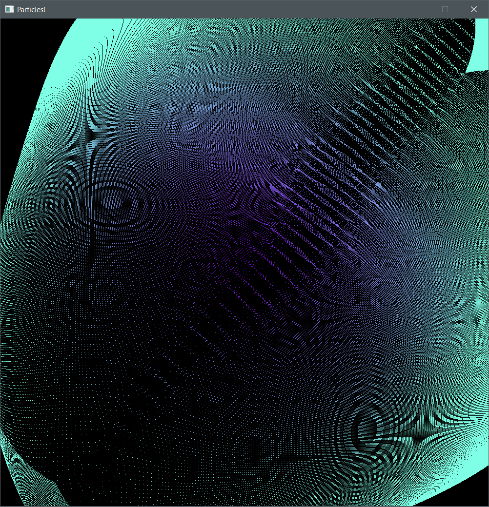

# OpenGL + SIMD + C++
## v1.0
It's a test project. Main purpose is to play with SIMD (Single Instruction Multiple Data). I'm using [vectorclass](https://github.com/vectorclass) library for SIMD, [SFML](https://github.com/sfml/sfml) for Window creation and input handling. 
# **Usage**
Use *left mouse button* to attract particles towards it. Hold *left shift* to attract them continuously. Use *R* key to reset the particles.
# **Command line arguments**
`-arg_name=value`, for example `-win_w=1280 -win_h=720`.
| argument  |  description | default value |
| :-  |  :- | :- |
| win_w  | window width, has to be divisible by 4 | 800 |
| win_h  | window height | 600 |
| fps  | FPS limit | 0 (no limit) |
| alignment  | alignment of particles memory, has to be power of 2 | 32 |
| pulse_demo | are we running the pulsating demo mode? Interaction is disabled in pulse mode. | 0 (non-zero means yes) |
| pulse_min | minimum pulse time, in milliseconds | 100 |
| pulse_max | maximum pulse time, in milliseconds | 900 |
| use_lines | use GL_LINE_LOOP instead of GL_POINTS, gives a cool effect | 0 (non-zero means yes) |

# Compiling
Just open the .sln using Visual Studio 2019 and compile. Binaries will in the `_binaries` folder.

# [Pulse demo](https://youtu.be/V5rohV-xLDM)
# [Clicking demo](https://youtu.be/A0FwfGXOCbs)
# Screens
Just note that the coolset thing about this program is that particles move really fast. It's hard to catch the fun stuff on still images. 
Pulsating particles mode:

Following screenshots were captured in a 1000x1000 window, 1 milion particles, clicking mode.

